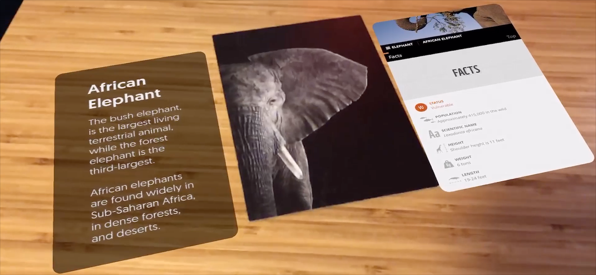

# Using ARKit and Image Tracking to Augment a Post Card

This is the supporting repository for the [Using ARKit and Image Tracking to Augment a Post Card](https://www.viget.com/articles/using-arkit-and-image-tracking/) blog post on [viget.com](http://viget.com).

Check out the `1-setup` branch as a starting point and work from there alongside the tutorial.
